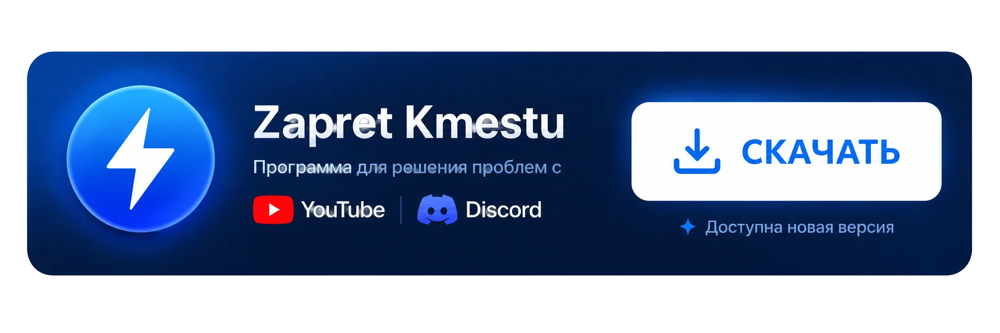
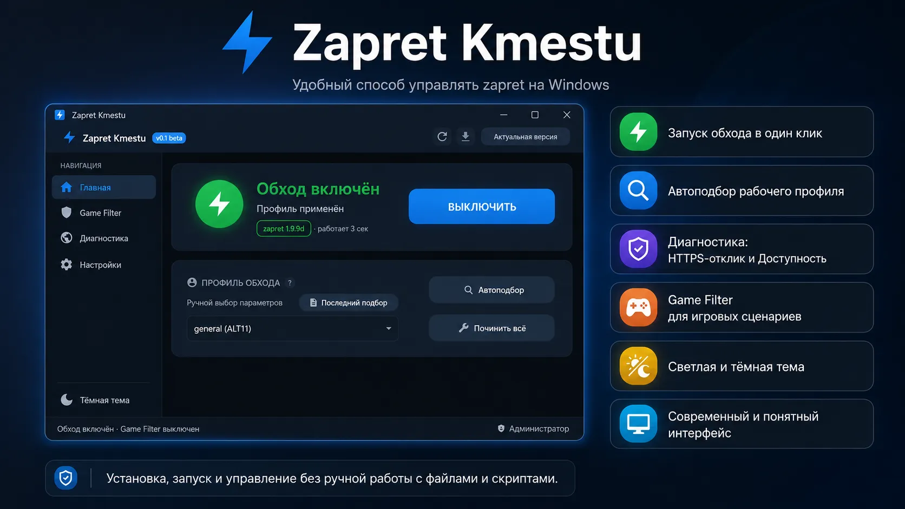

# ⚡Zapret Kmestu

**Zapret Kmestu** —  графическая оболочка для Windows, которая помогает установить, настроить и запускать `zapret` без ручной работы с файлами, скриптами и командной строкой. Программа восстанавливает работу `YouTube` и `Discord` (не VPN).

---

## ☕ Поддержать проект

Мой проект полностью бесплатен и всегда останется бесплатным.

Разработка, тестирование и поддержка приложения требуют времени и денег. Если программа оказалась полезной, вы сможете поддержать меня небольшой суммой.

**💎 GRAM / 💵 USDT (TON):** `UQAO3u5d0PU3RQLMSw0I5LeyWdVMUf1rDflMful3ac1p8kS1`

> Всем спасибо за поддержку ❤️

---

## ✨ Почему Zapret Kmestu

Оригинальный инструмент `zapret` чрезвычайно эффективен, но требует ручной настройки конфигураций, написания консольных скриптов и прямого администрирования служб Windows. Я создал Zapret Kmestu, чтобы полностью взять эту рутинную работу на себя.

Основные преимущества:
* Установка и обновление `zapret` в несколько кликов.
* Запуск и остановка обхода одной кнопкой.
* Удобный автоподбор рабочих параметров.
* Наглядный мониторинг доступности YouTube и Discord.
* Автоматическая работа в трее.
* Полноценная тёмная и светлая темы.

---

## 🚀 Возможности

| Возможность | Что даёт пользователю |
| :--- | :--- |
| **Установка zapret** | Не нужно вручную искать, скачивать и раскладывать файлы |
| **Запуск обхода** | Одна кнопка вместо команд и скриптов |
| **Профили обхода** | Можно выбрать профиль вручную или через автоподбор |
| **Автоподбор** | Программа помогает найти подходящий вариант |
| **Диагностика** | Показывает доступность и HTTPS-отклик для YouTube и Discord |
| **Трей** | Приложение может работать аккуратно в фоне |
| **Темы** | Поддерживаются светлый и тёмный режимы |

---

## 🧭 Как использовать

1. Скачайте архив из раздела **[Releases](https://github.com/kmestu/ZapretKmestu/releases/latest)**.
2. Распакуйте архив в любую удобную папку.
3. Запустите `ZapretKmestu.exe` от имени администратора.
4. Установите `zapret` кнопкой в интерфейсе.
5. Выберите профиль или запустите автоподбор параметров.
6. Нажмите кнопку запуска обхода.
7. Проверьте статус подключения в блоке диагностики.

---

## 🖥️ Системные требования

| Требование | Значение |
| :--- | :--- |
| **ОС** | Windows 10 / Windows 11 |
| **Архитектура** | x64 |
| **Права** | Администратор |
| **Интернет** | Нужен для установки и обновления zapret |

---

## 🛡️ Безопасность и предупреждения

* Скачивайте приложение только из официального репозитория на GitHub.
* Для управления службами Windows требуются права администратора.
* Приложение не является VPN-сервисом и не пропускает ваш трафик через сторонние сервера.
* Все сторонние компоненты распространяются по лицензиям их авторов.

---

## 🙏 Благодарности

Проект был бы невозможен без работы авторов и участников:
- [Flowseal](https://github.com/Flowseal) — за проект `zapret-discord-youtube`.
- [bol-van](https://github.com/bol-van) — за оригинальный движок `zapret`.

---

## 📄 Лицензия

Код Zapret Kmestu распространяется на условиях лицензии, указанной в файле `LICENSE`.

Сторонние компоненты сохраняют свои собственные лицензии. Подробнее см. `THIRD_PARTY_NOTICES.md`.
